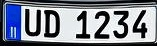

# AlprNet

A .NET Standard library for license plate detection and recognition. It uses public and open source ONNX models for inference.

> **Note:** The library works, but it is a work in progress (WIP). Once further polished, a NuGet package will be published.

## Demo

### Input Image


### Detected License Plate


**License plate string:** `UD 1234`

## Usage

Example usage is shown below. See [`Program.cs`](AlprNet/AlprNet.ConsoleApp/Program.cs) for the full inference code.

```csharp
Mat plateCropImg;

// Plate detection
{
    var modelDirPath = Path.Combine(Directory.GetCurrentDirectory(), "PlateDetection\\Models");
    var modelPath = Path.Combine(modelDirPath, "yolo-v9-t-512-license-plates-end2end.onnx");
    using var licensePlateDetector = new LicensePlateDetector(modelPath);
    var image = Mat.FromImageData(await File.ReadAllBytesAsync("car.jpg"));

    Console.WriteLine("Running license plate detection");
    var detections = licensePlateDetector.Run(image);
    var detectedPlate = detections.Single();

    plateCropImg = detectedPlate.ToPlateCropImage(image);
    Console.WriteLine("License plate detected and cropped");
    plateCropImg.SaveImage("car_plate.jpg");
}

// Plate recognition
{
    var modelDirPath = Path.Combine(Directory.GetCurrentDirectory(), "PlateRecognition\\Models");
    var modelPath = Path.Combine(modelDirPath, "cct_s_v1_global.onnx");
    var modelConfigPath = Path.Combine(modelDirPath, "cct_s_v1_global_plate_config.yaml");
    using var recognizer = new LicensePlateRecognizer(modelPath, modelConfigPath);

    Console.WriteLine("Running license plate recognition");
    var result = recognizer.Run([plateCropImg], returnConfidence: true);

    var plate = result.plates.Single();
    Console.WriteLine($"License plate is: {plate}");
}
```

## Models
Models are included in the repository but can also be downloaded via utility classes:
- `PlateDetectionModelsRepository`
- `PlateOcrModelsRepository`

## Acknowledgments

- YOLO v9 models and inference code for license plate detection: (https://github.com/ankandrew/open-image-models)
- OCR models and inference code for license plate recognition: (https://github.com/ankandrew/fast-alpr)